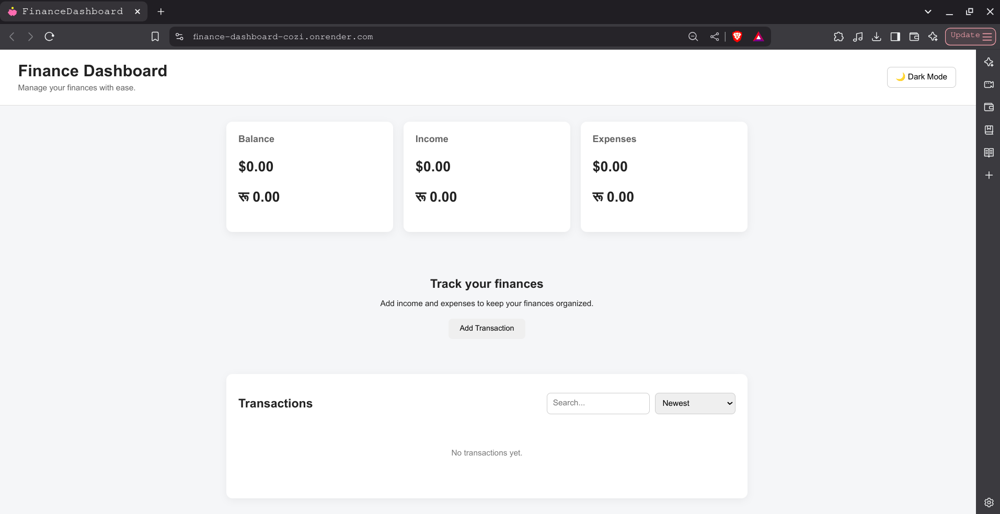
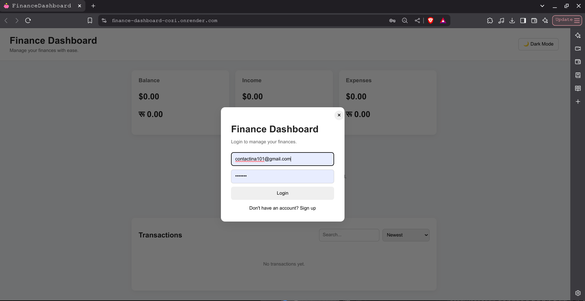
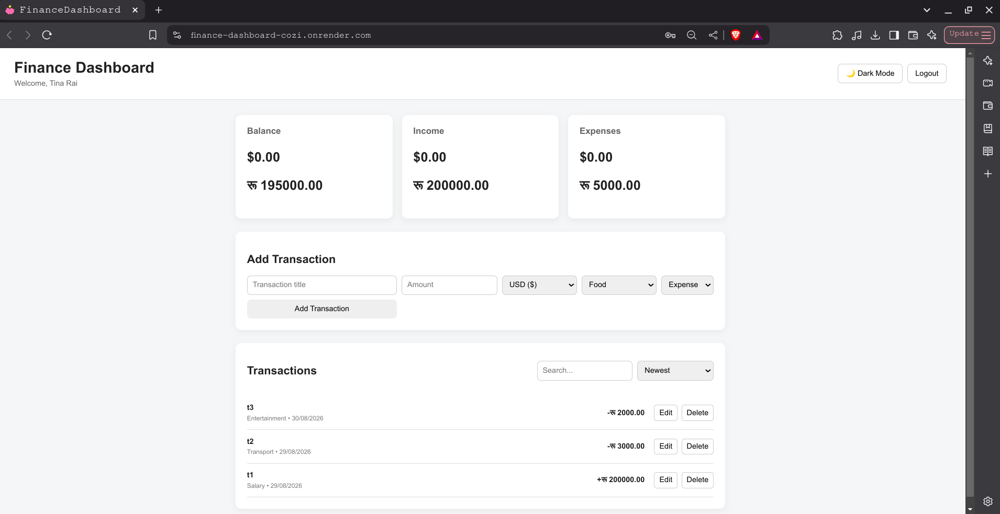
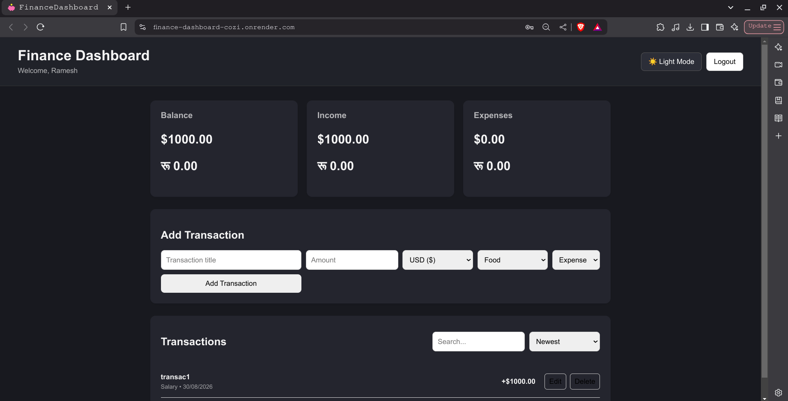

# Personal Finance Dashboard

The project originally started as a **vanilla JavaScript finance dashboard** using Local Storage and was later rebuilt into a full-stack application with **React, Express.js, PostgreSQL, and session-based authentication**.

## Live Demo

[View Financedashboard Live](https://finance-dashboard-cozi.onrender.com/)
## GitHub Repository

https://github.com/tina-rai/finance-dashboard

---
## Screenshots

### Dashboard



### Authentication



### Transactions



### Dark Mode




---
## Features

### Authentication

* User signup and login
* Session-based authentication
* Secure password hashing
* User-specific transaction data
* Logout functionality
* Authentication appears when users attempt to add a transaction

### Transaction Management

* Add income and expense transactions
* Edit transactions
* Delete transactions
* Transaction categories
* Transaction dates
* User-specific transaction history
* USD and Nepalese Rupee (NPR) support

### Dashboard

* Balance summary
* Income summary
* Expense summary
* Separate USD and NPR totals
* Transaction search
* Transaction sorting

  * Newest
  * Oldest
  * Highest amount
  * Lowest amount
* Dark / Light mode
* Responsive interface

### Data & Backend

* PostgreSQL database
* Persistent transaction storage
* REST API
* User-specific database records
* Express session authentication
* Protected transaction routes

## Tech Stack

### Frontend

* React
* Vite
* JavaScript (ES6+)
* HTML5
* CSS3

### Backend

* Node.js
* Express.js
* Express Session
* REST API

### Database

* PostgreSQL
* Neon

### Authentication

* bcryptjs
* Express Session

### Deployment

* Render
* Neon PostgreSQL

## Project Structure

```text
finance-dashboard/
│
├── client/
│   ├── src/
│   │   ├── assets/
│   │   │   ├── hero.png
│   │   │   ├── react.svg
│   │   │   └── vite.svg
│   │   │
│   │   ├── components/
│   │   │   ├── Auth.jsx
│   │   │   ├── Header.jsx
│   │   │   ├── SummaryCards.jsx
│   │   │   ├── TransactionForm.jsx
│   │   │   └── TransactionList.jsx
│   │   │
│   │   ├── App.jsx
│   │   ├── App.css
│   │   ├── index.css
│   │   └── main.jsx
│   │
│   ├── index.html
│   ├── package.json
│   ├── package-lock.json
│   └── vite.config.js
│
├── server/
│   ├── routes/
│   │   └── transactions.js
│   │
│   ├── auth.js
│   ├── postgres.js
│   └── server.js
│
├── js/
│   ├── app.js
│   ├── dom.js
│   ├── storage.js
│   ├── transactions.js
│   ├── ui.js
│   └── utils.js
│
├── screenshots/
│   ├── dashboard.png
│   ├── login.png
│   ├── transactions.png
│   └── dark-mode.png
│
├── index.html
├── style.css
├── package.json
├── package-lock.json
├── .gitignore
└── README.md
```


## Getting Started

### Prerequisites

Make sure you have installed:

* Node.js
* npm
* PostgreSQL database

### Clone the repository

```bash
git clone https://github.com/tina-rai/finance-dashboard.git
cd finance-dashboard
```

### Install dependencies

Install backend dependencies:

```bash
npm install
```

Install frontend dependencies:

```bash
cd client
npm install
cd ..
```

### Environment Variables

Create a `.env` file in the project root:

```env
DATABASE_URL=your_postgresql_connection_string
SESSION_SECRET=your_session_secret
NODE_ENV=development
```

### Run the Backend

```bash
node server/server.js
```

The backend runs on:

```text
http://localhost:5000
```

### Run the Frontend

Open another terminal:

```bash
npm run dev --prefix client
```

The frontend normally runs on:

```text
http://localhost:5173
```

Vite may use another available port if `5173` is already occupied.

## API Overview

### Authentication

```text
POST /api/auth/signup
POST /api/auth/login
POST /api/auth/logout
GET  /api/auth/me
```

### Transactions

```text
GET    /api/transactions
POST   /api/transactions
PUT    /api/transactions/:id
DELETE /api/transactions/:id
```

Transactions are associated with the authenticated user so that each account has its own financial data.

## Database

The application uses PostgreSQL for persistent storage.

The transactions table stores information such as:

```text
id
user_id
title
amount
category
type
currency
transaction_date
created_at
```

The `currency` field currently supports:

* USD
* NPR

## Currency Support

The dashboard supports multiple currencies without combining values from different currencies.

For example:

```text
USD Balance
$500.00

NPR Balance
रू 25,000.00
```

This prevents USD and NPR amounts from being incorrectly added together.

## Deployment

The application is deployed using:

* **Render** for the application
* **Neon** for PostgreSQL

Environment variables are configured through the deployment platform rather than being committed to the repository.

## Original Vanilla JavaScript Version

The project originally used:

* HTML
* CSS
* Vanilla JavaScript
* Local Storage
* Chart.js

The original implementation remains in the repository under the root `js/` directory.

The current application is the full-stack React version located under:

```text
client/
server/
```

This evolution allowed the project to move from browser-only storage to a persistent, authenticated multi-user application.

## Future Improvements

* Budget limits and alerts
* More detailed financial charts
* Recurring transactions
* Monthly reports
* Additional currencies
* Improved mobile experience
* Financial data export for the full-stack version
* More advanced spending analytics

## Author

**Tina Rai**

GitHub: https://github.com/tina-rai

```
```

